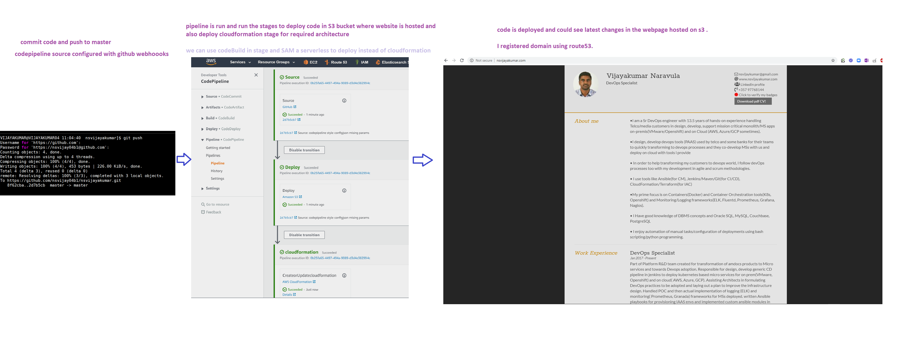
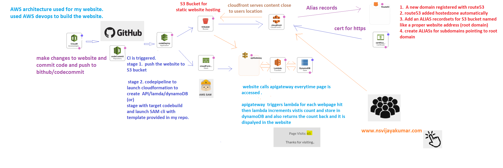

# Build a static website and host it almost free on AWS

* You can host anything you want, in my case, i wanted to share my CV to recruiter in a Devops fashion.
* I created this github repo ( so, others can also learn from it ) and put all the code, cloudformation/SAM templates here.
* I am using AWS free tier account, so, it is almost free ( very small fee for using route53 hosted zone and depends on no of GET requests to your webpage you will incurr some fee too)
* Most of the cost for me is for registering a website domain ( ~ 5-15$ per year, Depends on the domain name you choose it varies )


# AWS DevOps using AWS code*

* AWS cloud9 for development using IDE and even test locally changes using SAM ( Serverless Application Model )
* When you commit the code in codeCommit (or github in my case), a CI (codeBuild) is triggered by codePipeline.
* You can use mix and match, use linear action groups or parallel actions within stages.
* Build, test, deploy stages could be run in pipeline.
* Finally CD the artifcats to S3 bucket for production.




# using AWS SAM(  Serverless Application Model )

* Either use AWS Cloud9 or install SAM CLI on your machine , follow [this](https://docs.aws.amazon.com/serverless-application-model/latest/developerguide/serverless-sam-cli-install-linux.html)
* Using SAM to deploy your serverless app is very easy, follow [this](https://docs.aws.amazon.com/serverless-application-model/latest/developerguide/serverless-getting-started-hello-world.html)
   1.  `sam init`   that initializes your project directory
   2.  `sam build`  that builds the dependencies needed , wraps your lamda code to zipped.
   3.  `sam deploy --guided` that deploys your application to the AWS cloud (it involves transforming SAM templates to cloudformation and create cloudformaton stack.)
* but, what we need to do here is instead of the sample hellow world code, we copy ours from `SAM` folder in this proj.

`Thats it ..Happy Serverless development !!!`

# Requirements

* Github account( to share publicly for non-AWS users) or AWS codeCommit ( keep in mind, you have to auth codePipeline to access your guthub)
* AWS free tier account  ( https://aws.amazon.com/free/ )
* IDE with git for development ( or Cloud9 on AWS )
* Register a domain and configure hostedzone in Route53 ( hostedzone is created automatically if registered also using Route53 )
* create two buckets for example 'www.sample.com' , 'sample.com' ( with full DNS name of your website) and allow public access.
* create ALIAS recordset in Route53 to point to your S3 bucket.


# Completed Features

* A simple HTML Website to show case my resume
* Static S3 Hosted Website
* DynamoDB and Lambda based serverless visitor counter
* Both Cloudformation and AWS SAM templates 
* codePipeline with stages 
   1. Take source from github 
   2. Delpoy code on S3
   3. launch cloudformation template to build DynamoDB, lambda & Apigateway using cloudformation (used this) 
          (or)
      launch codeBuild with buildspec using SAM CLI to deploy SAM templates to achieve the same.( you can take this approach too)
 * A nice 404 error page when there is an issue.
      

# Features in pipeline

* Cloudfront Distribution 
* ACM Cert for SSL
* Automation of creating S3 bucket and configuring staticwebsite and its DNS RSs.
* Automation of creation of codePipeline and IAM role it needed.
* creation of custom api domain and its mappings and use this custom domain in JS to fetch the visitors count, right now it is hardcoded with current APIgateway url.

# Issues faced.
* main issue i faced is with CORS as S3 website is of different domain of api , we have to enable CORS.
* `Go to S3 bucket -> Permissions -> CORS configuration`  and add this
```
<?xml version="1.0" encoding="UTF-8"?>
<CORSConfiguration xmlns="http://s3.amazonaws.com/doc/2006-03-01/">
<CORSRule>
    <AllowedOrigin>*</AllowedOrigin>
    <AllowedMethod>GET</AllowedMethod>
    <AllowedMethod>HEAD</AllowedMethod>
    <AllowedMethod>POST</AllowedMethod>
    <AllowedHeader>*</AllowedHeader>
</CORSRule>
</CORSConfiguration>
```
* on APIgateway side and JS side CORS chages are already in the code. But, in case you face an issue , do this on APigateway side.

`Goto APIGateway -> Select your API -> Resources -> select the apiPath( count in my case) -> Click Actions button above it  ->  Enable CORS  ->  Deploy API again.`

* worth noting, but , already handled, cloudformation parameters configuration json which used by cloudformation doesnot work while using codePipeline, correct is added in code. This is how diff looks like


**cloudformation/cloudformation-style-config.json**
```
[
   {
     "ParameterKey": "APIName",
     "ParameterValue": "mycv-api"
   },
   {
     "ParameterKey": "LambdaFunctionName",
     "ParameterValue": "mycv-lambda"
   },
   {
     "ParameterKey": "APIPath",
     "ParameterValue": "count"
   } ...... etc 
]
```

**cloudformation/codepipeline-style-config.json**

```
{
  "Parameters": {
    "APIName": "mycv-api",
    "LambdaFunctionName": "mycv-lambda",
    "APIPath": "count"  .......etc 
}

```


# Some features of my resume sharing website.

* You allow to download a PDF copy of the resume with a button.
* Share your badges public url to verify ( all the certifications done )
* share your linkedin profile link.
* Click on email to launch your email editor to send an email to you.
* In the footer, you can see how many people visited your website.

# AWS architecture used



# Source courtesy : AlanTuringResume - this is the source repo i inspired from

Repository for my blog article: [How to build a free static resume site with AWS S3, Cloudfront, and Route 53](https://seanjziegler.com/how-to-build-a-free-static-resume-site-with-aws-s3-cloudfront-and-route-53/)

### License

MIT (C) 2020


